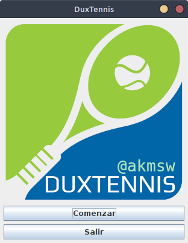
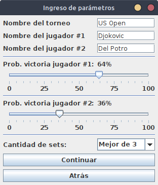
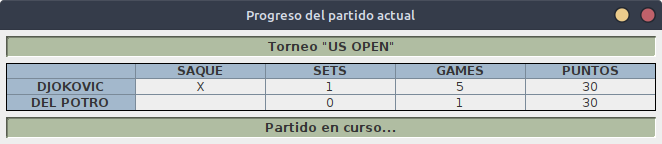
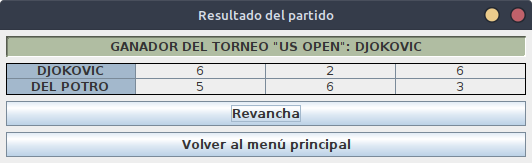
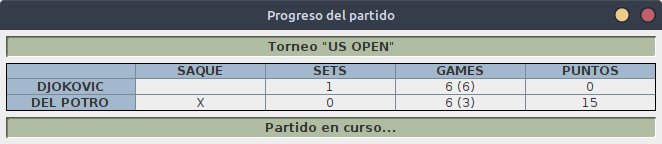
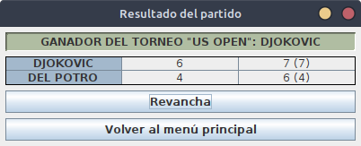

# 🎾 DuxTennis

[](https://github.com/akmsw/duxtennis/actions/workflows/maven.yml)
[](https://github.com/akmsw/duxtennis/issues)
[](https://checkstyle.sourceforge.io/)
[](https://www.sonarlint.org/)

[](https://openjdk.org/projects/jdk/11/)
[](https://maven.apache.org/)
[](https://en.wikipedia.org/wiki/Cross-platform_software)

## 📜 Índice
- [¿Qué es?](https://github.com/akmsw/duxtennis#-qu%C3%A9-es)
- [Requisitos generales](https://github.com/akmsw/duxtennis#-requisitos-generales)
  - [Java](https://github.com/akmsw/duxtennis#-java)
    - [Versión mínima](https://github.com/akmsw/duxtennis#versi%C3%B3n-m%C3%ADnima)
    - [Versión recomendada](https://github.com/akmsw/duxtennis#versi%C3%B3n-recomendada)
- [Requisitos para compilación](https://github.com/akmsw/duxtennis#%EF%B8%8F-requisitos-para-compilaci%C3%B3n)
  - [Apache Maven](https://github.com/akmsw/duxtennis#-apache-maven)
    - [Versión recomendada](https://github.com/akmsw/duxtennis#versi%C3%B3n-recomendada-1)
- [Descarga](https://github.com/akmsw/duxtennis#-descarga)
- [Instalación y ejecución](https://github.com/akmsw/duxtennis#%EF%B8%8F-instalaci%C3%B3n-y-ejecuci%C3%B3n)
- [Compilación manual](https://github.com/akmsw/duxtennis#-compilaci%C3%B3n-manual)
- [¿Cómo se usa?](https://github.com/akmsw/duxtennis#-c%C3%B3mo-se-usa)
- [Capturas de pantalla](https://github.com/akmsw/duxtennis#-capturas-de-pantalla)

## 🔎 ¿Qué es?
Desarrollado completamente en Java, este programa representa la segunda parte de la prueba técnica del proceso de selección en DuxSoftware.\
Se trata de un simulador de partidos de tenis de 2 jugadores.

## 📦 Requisitos generales
### ☕ Java
- #### Versión mínima
    🟡 [Java 11](https://www.oracle.com/ar/java/technologies/javase/jdk11-archive-downloads.html)
- #### Versión recomendada
    🟢 [Java 17](https://www.oracle.com/java/technologies/javase/jdk17-archive-downloads.html) *(o más reciente)*

## ⚙️ Requisitos para compilación
### 🪶 Apache Maven
- #### Versión recomendada
    🟢 [Apache Maven 3.8.6](https://maven.apache.org/download.cgi)

## 📥 Descarga
La versión estable más reciente del programa se encuentra disponible para descargar en la sección [releases](https://github.com/akmsw/duxtennis/releases) de este proyecto.

## ▶️ Instalación y ejecución
Más allá de los requisitos listados, no hace falta ninguna instalación para correr este programa.\
Una vez descargado el archivo con extensión ***.jar***, e independientemente del sistema operativo que se utilice, se lo puede ejecutar con un simple *doble click*.
Una alternativa es abrir una terminal dentro de la carpeta contenedora del archivo y ejecutar el comando:
```bash
java -jar nombre_del_archivo.jar
```

## 🛠️ Compilación manual
Para compilar manualmente el programa, asumiendo que tanto los [requisitos generales](https://github.com/akmsw/duxtennis#-requisitos-generales) como los [requisitos para compilación](https://github.com/akmsw/duxtennis#%EF%B8%8F-requisitos-para-compilaci%C3%B3n) han sido instalados correctamente, se debe dirigir a la carpeta contenedora del proyecto y ejecutar Apache Maven haciendo uso del archivo `pom.xml` con el siguiente comando:
```bash
mvn package --file pom.xml
```
o, simplemente:
```bash
mvn package
```

Esto creará una carpeta llamada `target`. Dentro de esa carpeta estará el archivo ejecutable en formato `.jar`. Para ejecutarlo, dentro de la carpeta contenedora, se debe ejecutar el comando indicado anteriormente:
```bash
java -jar nombre_del_archivo.jar
```

## 📝 ¿Cómo se usa?
Para comenzar un partido, se debe ingresar el nombre del torneo y de los dos jugadores que participan en el mismo. Luego, se puede calibrar la probabilidad que tiene cada jugador de ganar el partido (recordar que las probabilidades van de 0% a 100% y son complementarias). Finalmente, se puede elegir si jugar un partido a 3 sets o a 5 sets.

Cuando estos parámetros hayan sido establecidos, se podrá hacer click en el botón 'Continuar' para comenzar la simulación.

En ese momento se abrirá una ventana que mostrará el progreso de la simulación del partido, indicando cuántos puntos, games y sets ganados tiene cada jugador en el transcurso del mismo. Durante esta simulación, el usuario sólo puede observar el progreso.

Cuando la simulación finalice, el usuario tendrá frente a sí una nueva ventana que mostrará el resumen del partido, indicando el resultado de cada set y el ganador del partido del torneo. En este punto, el usuario puede optar por jugar una revancha (iniciar un partido con los mismos jugadores y los mismos parámetros que los ingresados en un principio), o volver al menú principal para comenzar otra simulación distinta.

## 📸 Capturas de pantalla
\
*Ventana del menú principal*

\
*Ventana de ingreso de parámetros*

\
*Ventana de progreso de simulación de partido sin deuce ni empates*

\
*Ventana de progreso de simulación de partido con deuce*

\
*Ventana de progreso de simulación de partido con empate*

\
*Ventana de resultado de partido sin empates*

\
*Ventana de resultado de partido con empates*